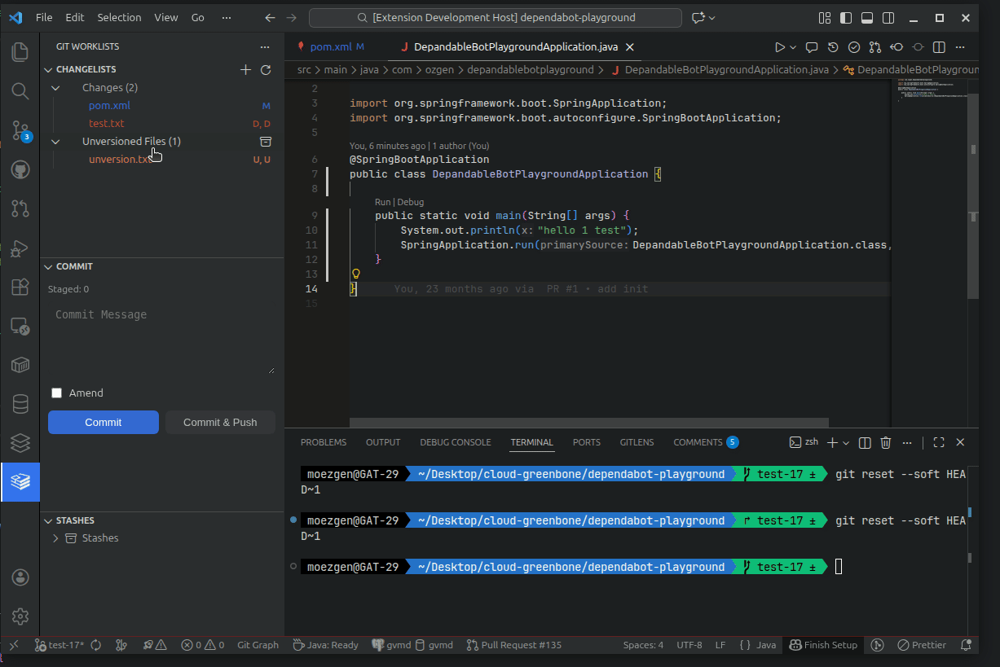

# Git Worklists

**Git Worklists** is a Visual Studio Code extension that provides a lightweight, Git-focused workflow for organizing changes, staging files, committing, and managing stashes, all through a custom UI.

It is designed for developers who want **explicit control over staging, commits, and stash workflows**, without relying on VS Code’s built-in Source Control view.

---

## Demo

---

# Features

---

## Changelists View

A structured way to organize and stage changes.

- Displays **Changes** and **Unversioned** files clearly
- Create, move, and delete **custom changelists**
- Move files between changelists (per file or per group)
- Move selected files to another changelist
- File-level and group-level **checkboxes** for staging / unstaging
- Visual file decorations (badges)
- Click files to open instantly
- Automatic reconciliation with Git status
- Files move automatically between:
  - **Unversioned** when newly created
  - **Changes** when tracked / modified

- Safe behavior when staging / unstaging newly created files

---

## Commit Panel

A focused commit experience separate from VS Code SCM.

- Custom **Commit Message** field
- **Amend** support (with safe handling)
- **Commit** and **Commit & Push**
- Live staged file counter
- Clear error feedback
- Safe confirmation before force-with-lease push

---

## Stash Management

Integrated Git stash support directly inside Git Worklists.

### Create Stash (Per Changelist)

- Stash all tracked changes from a selected changelist
- Automatically tags stashes with their originating changelist
- Optional custom stash message
- Safe handling of untracked files (skipped unless explicitly supported)
- Immediate UI refresh after stash

### Stash List View

- Dedicated **Stashes** view
- Clean, readable labels (no raw `stash@{0}` noise)
- Displays originating changelist (e.g. `[CL:changes]`)
- Shows branch context
- Hover tooltip includes full Git reference

### Stash Actions

Per-stash context actions:

- **Apply Stash** - restore changes without removing stash
- **Pop Stash** - restore changes and remove stash
- **Delete Stash** - drop stash with confirmation
- Refresh support

---

## Git Integration

Uses **Git CLI directly** (no VS Code SCM provider).

Supported operations:

- `git add`
- `git restore --staged`
- `git commit`
- `git commit --amend`
- `git push`
- `git stash push`
- `git stash list`
- `git stash apply`
- `git stash pop`
- `git stash drop`

All operations are executed per repository using repo-relative paths.

---

# Requirements

- Git installed and available in PATH
- Workspace opened inside a Git repository
- VS Code **v1.108.0** or newer

---

# Usage

---

## Changelists & Commits

1. Open a Git repository in VS Code
2. Open **Git Worklists** from the Activity Bar
3. Stage or unstage files using checkboxes
4. Organize files into custom changelists
5. Enter a commit message
6. (Optional) enable **Amend**
7. Click **Commit** or **Commit & Push**

---

## Stashes

1. Right-click a changelist -> **Stash changes…**
2. Enter an optional stash message
3. Open the **Stashes** view
4. Apply, Pop, or Delete stashes as needed

---

# Extension Settings

This extension does not contribute custom VS Code settings yet.

---

# Known Limitations

- No partial staging (no hunk / line staging)
- No multi-repository support
- Merge conflicts must be resolved manually
- Untracked files are not included in per-changelist stash by default
- GitHub / GitLab PR features are not included

---

# Roadmap

Planned improvements:

- Include-untracked option for stash
- Multi-repository support
- Partial staging (hunk-based)
- Improved visual polish
- Extended test coverage
- Performance optimizations

---

# Release Notes

## 0.0.2

### Added

* Discard action for files directly from the Changelists view

### Fixed

* Correct staged file detection (UI now accurately reflects Git index state)
* Automatic upstream setup when pushing new local branches
* Improved amend behavior when commit would otherwise be empty

---

## 0.0.1

### Added

* Changelists view
* Custom commit panel
* Git staging, commit, amend, push support
* Per-changelist stash creation
* Dedicated Stashes view
* Apply / Pop / Delete stash actions
* Move files between changelists
* Move group to changelist
* Move selected files to changelist
* Improved reconciliation with Git status
* Clean stash label formatting
* Context menu + icon actions
* Error handling improvements

---

# Development Philosophy

Git Worklists intentionally avoids VS Code’s built-in SCM provider.

Instead, it builds a focused, predictable workflow using:

- Tree Views
- Commit UI
- Git CLI

The goal is **clarity, explicit control, and zero hidden magic**.

---

**Git Worklists - focused Git workflows without surprises. 🚀**

---
