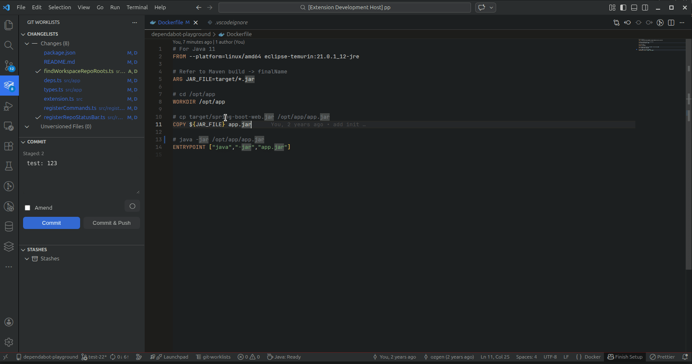
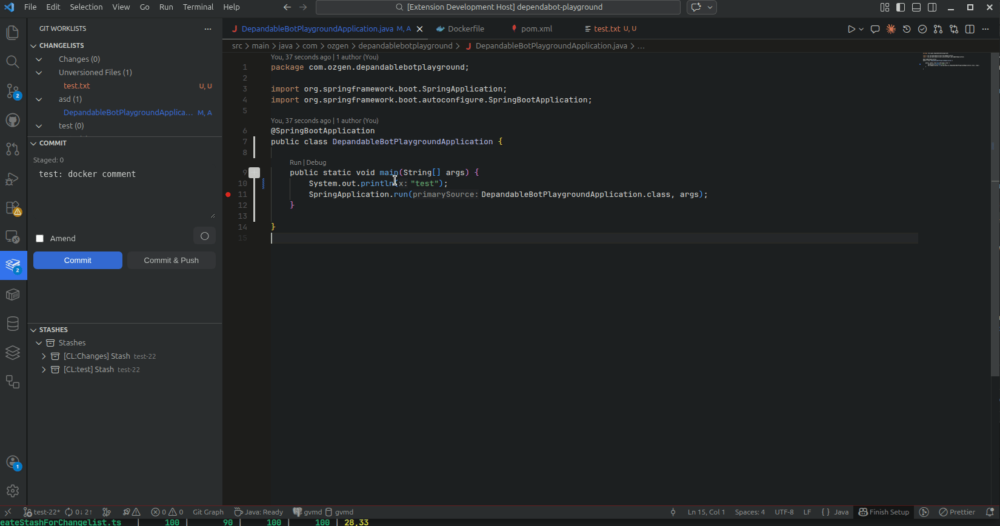
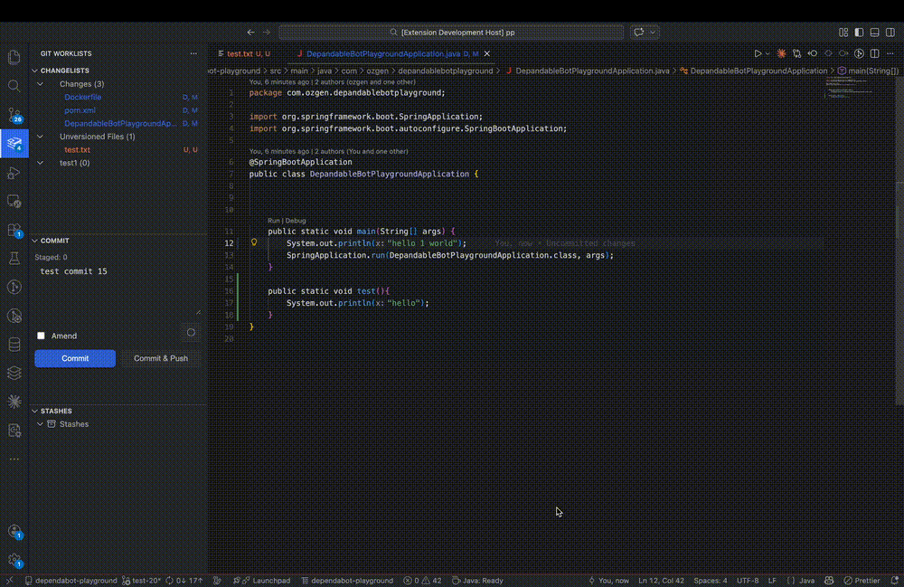

# Git Worklists

---

## IntelliJ-style changelists for VS Code

Git Worklists brings structured changelists to VS Code, allowing you to organize changes into clear, independent work units instead of managing a flat list of modified files.

It provides explicit control over:

- staging
- partial staging (line-level)
- commits and amend
- push workflows
- stash management

All through a predictable UI built directly on top of the Git CLI.

Designed for developers who:

- miss IntelliJ changelists
- find VS Code’s default Source Control limiting
- want precise and explicit control over commits

---

## Why Git Worklists?

VS Code presents all changes in a flat list.

Git Worklists lets you:

- group related changes into changelists
- stage and commit them independently
- keep your work organized and intentional

---

## Demo

### Core Workflow

---

## Additional Features

### Multi-Repository Workspace Support

Switch between repositories directly from the status bar in multi-repo workspaces.

---

### Drag & Drop and Changelist Management

Organize files quickly using drag and drop across changelists.

---

### Conventional Commits Integration

Generate structured commit messages directly from the Commit Panel using the Conventional Commits extension.

---

### Partial Line Staging

Stage selected lines directly from the editor or diff view.

---

### Stash Preview and Management

Inspect and manage stashed changes with file-level previews.

---

## Key Features

- IntelliJ-style changelists
- Move files between changelists
- Partial line staging
- Dedicated commit panel (commit, amend, push)
- Built-in stash management
- Drag and drop organization
- Explicit Git workflow with no hidden behavior

---

## Feature Overview

### Changelists

- Create, rename, and delete changelists
- Move files between changelists
- Drag and drop support
- Stage and unstage per file or per group

### Partial Staging

- Stage selected lines from editor or diff
- Clear indication of partially staged files

### Commit Workflow

- Dedicated commit panel
- Commit, amend, commit & push
- Push-only support
- Optional Conventional Commits integration

### Stash Management

- Create stash per changelist
- Inspect stash contents
- Apply, pop, and delete stashes

---

## Documentation

For full details, advanced workflows, and edge-case behavior:

See the manual: [docs/MANUAL.md](docs/MANUAL.md)

---

## Requirements

- Git installed and available in PATH
- Workspace opened inside a Git repository
- VS Code **v1.109.0** or newer

---

## Development Philosophy

Git Worklists avoids VS Code’s built-in SCM provider and instead builds a focused workflow using:

- Tree Views
- Commit UI
- Git CLI

The goal is clarity, explicit control, and predictable behavior.

---

**Git Worklists - focused Git workflows without surprises. 🚀**

---
