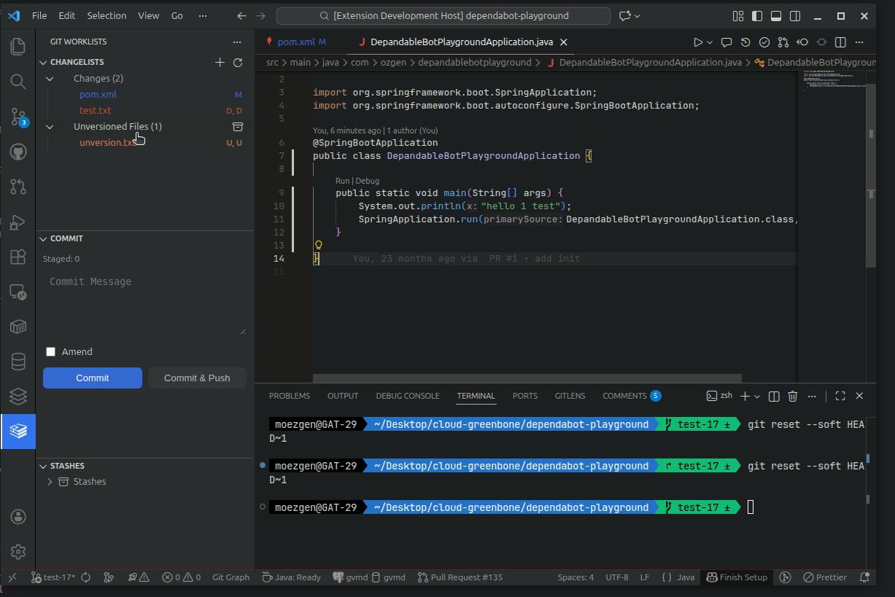
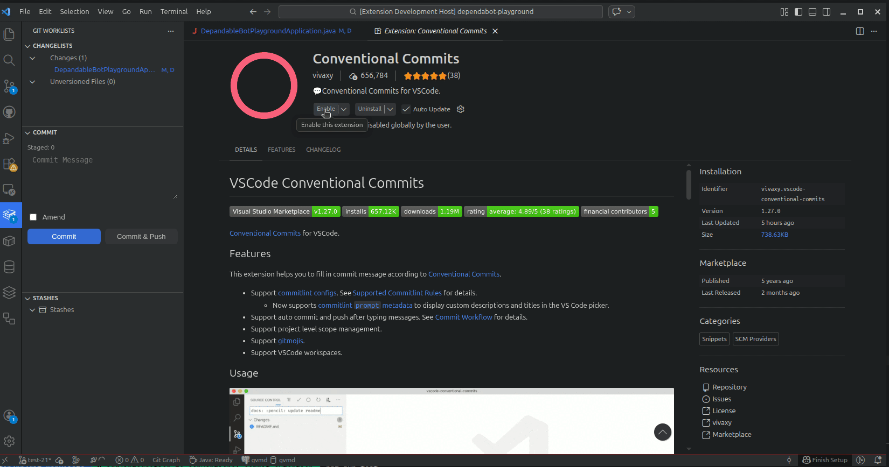
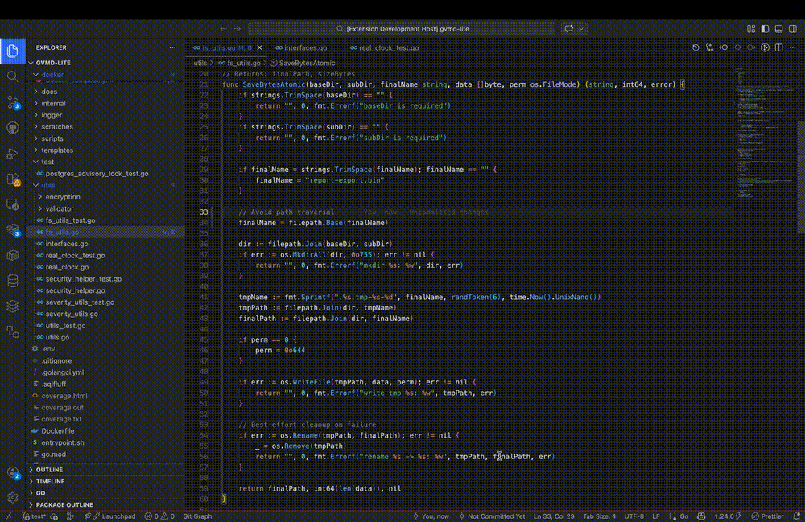

# Git Worklists

---

**Git Worklists** is a Visual Studio Code extension that provides a lightweight, Git-focused workflow for organizing changes, staging files, committing, pushing, and managing stashes, all through a dedicated, predictable UI.

It is designed for developers who want **explicit control over staging, commits, amend, push, and stash workflows**, without relying on VS Code’s built-in Source Control view.

---

## Demo

---

### Conventional Commits Integration

Generate structured commit messages directly from the Commit Panel using the Conventional Commits extension.

---

# Features

---

## Changelists View

A structured way to organize and stage changes.

- Displays **Changes** and **Unversioned** files clearly

- Shows **file count badges** per worklist and a total badge on the Activity Bar icon

- Unversioned files are detected via `git ls-files --others --exclude-standard`

- Untracked directories are not shown as placeholder entries

- Files are displayed in Source Control style:
  - **File name** as primary label
  - **Folder path** shown as description

- Create, move, **rename**, and delete **custom changelists**

- Move files between changelists (per file or per group)

- **Drag and drop** files or entire changelist groups onto another changelist

- Move selected files to another changelist

- File-level and group-level **checkboxes** for staging / unstaging

- State-aware inline action:
  - Shows **Stage** when file is unstaged
  - Shows **Unstage** when file is staged

- Stage All / Unstage All per changelist

- Visual file decorations (badges)

- Decorations are automatically refreshed after commit or push (no stale indicators)

- File context menu actions:
  - **Open Diff** (HEAD <-> Working Tree)
  - **Open Source File** (jump directly to the working tree file)
  - **Discard**
  - **Move to Changelist**
  - **Move Staged Files to Another Changelist…**
    - From a changelist: only staged files in that changelist
    - From a staged file: all staged files

  - **Move Staged Files into Stash…**
    - From a changelist: only staged files in that changelist
    - From a staged file: all staged files
    - Aborts safely if the message dialog is cancelled

- Staged-only actions:
  - Only staged files are affected
  - Unstaged files remain untouched

---

### Diff Integration

- Click a file row to open a **HEAD <-> Working Tree diff**

- Clicking a file does NOT change staging state

- Diff view works correctly for:
  - Initial commit (no parent commit)
  - Newly added files
  - Renamed files
  - Missing parent references

- Dedicated **Close Diff Tabs** button in the view title

- Optional automatic closing of diff tabs after:
  - Commit
  - Push

- Automatic reconciliation with Git status

- Files move automatically between:
  - **Unversioned** when newly created
  - **Changes** when tracked / modified

- Optional prompt when new files are created:
  - **Add to Git** (stages file and moves it to Changes)
  - **Keep Unversioned**
  - **Disable prompt**

- Safe behavior when staging / unstaging newly created files

- Newly added (staged) files require confirmation before permanent deletion
- Changelist-level **Discard All Changes** action:
  - Categorized confirmation (unversioned / newly added / tracked)
  - Safe bulk restore using `git restore`
  - Permanent deletion confirmation for unversioned files

All staging state reflects the actual Git index.

---

## Commit Panel

A focused commit experience separate from VS Code SCM.

- Custom **Commit Message** field

- Commit message draft is automatically preserved
- **Conventional Commits integration**
  - ◯ button next to Amend to generate structured commit messages
  - Automatically syncs generated message into the custom commit panel
  - Button is hidden if the extension is not installed
  - Prevents Source Control view from stealing focus

- Live staged file counter

- Inline warning when attempting to commit with no staged files

- **Amend support**
  - Supports message-only amend (no staged files required)
  - Handles empty-amend edge cases safely
  - Amend checkbox automatically resets after a successful commit or commit & push

- **Commit**

- **Commit & Push**

- **Push-only support** (push existing local commits even if nothing is staged)

- Safe confirmation before force-with-lease push

- Automatic upstream setup for new local branches

- Push preview panel when multiple outgoing commits exist:
  - Shows commit hashes and subjects before pushing
  - Requires explicit confirmation

- Clear and actionable error feedback

Commit behavior is predictable and aligned with Git CLI behavior.

> Conventional Commits integration works with the
> [Conventional Commits extension](https://marketplace.visualstudio.com/items?itemName=vivaxy.vscode-conventional-commits).
> The integration is optional and activates automatically when the extension is installed.

---

## Stash Management

Integrated Git stash support directly inside Git Worklists.

### Create Stash (Per Changelist)

- Stash all tracked changes from a selected changelist
- Stash the **Unversioned changelist** directly new (untracked) files are included via `--include-untracked`
- Automatically tags stashes with their originating changelist
- Optional custom stash message
- Immediate UI refresh after stash

### Stash List View

- Dedicated **Stashes** view
- Stashes are displayed as expandable (accordion-style) nodes
- Expanding a stash reveals the list of files contained within it
- Status-aware file nodes (A / M / D / R / C)
- Clean, readable labels (no raw `stash@{0}` noise)
- Displays originating changelist (e.g. `[CL:changes]`)
- Shows branch context
- Hover tooltip includes full Git reference

### Stash File Preview

- Click a stashed file to open a **diff preview**
  - Compares stash base commit (`stash^1`) with stash contents
- Newly added files in a stash open as single-file preview
- Large files are handled safely to prevent editor crashes
- Preview behavior is consistent with the main diff integration

### Stash Actions

Per-stash context actions:

- **Apply Stash** restore changes without removing stash; files are returned to their originating changelist
- **Pop Stash** restore changes and remove stash; files are returned to their originating changelist
- **Delete Stash** – drop stash with confirmation
- Refresh support

---

## Git Integration

Uses **Git CLI directly** (no VS Code SCM provider).

Supported operations:

- `git add`
- `git restore --staged`
- `git restore --staged --worktree`
- `git commit`
- `git commit --amend`
- `git push`
- `git push --force-with-lease`
- `git stash push`
- `git stash push --include-untracked`
- `git stash list`
- `git stash apply`
- `git stash pop`
- `git stash drop`
- `git diff --name-status`
- `git ls-files --others --exclude-standard`

All operations are executed per repository using repo-relative paths.

---

# Requirements

- Git installed and available in PATH
- Workspace opened inside a Git repository
- VS Code **v1.109.0** or newer

---

# Usage

---

## Changelists & Commits

1. Open a Git repository in VS Code
2. Open **Git Worklists** from the Activity Bar
3. Stage or unstage files using checkboxes
4. Organize files into custom changelists
5. Enter a commit message
6. (Optional) enable **Amend**
7. Click:
   - **Commit**
   - **Commit & Push**
   - Or push existing commits without staging new changes

---

## Stashes

1. Right-click a changelist -> **Stash changes…**
2. Enter an optional stash message
3. Open the **Stashes** view
4. Expand a stash to inspect its files
5. Click a file to preview its diff
6. Apply, Pop, or Delete stashes as needed

---

# Extension Settings

This extension contributes the following settings:

### `gitWorklists.promptOnNewFile`

- **Type:** boolean
- **Default:** `true`
- Shows a prompt when new files are created:
  - Add to Git
  - Keep Unversioned
  - Disable prompt

---

### `gitWorklists.ui.closeDiffTabsAfterCommit`

- **Type:** boolean
- **Default:** `false`
- Automatically closes diff tabs opened by Git Worklists after a successful commit.

---

### `gitWorklists.ui.closeDiffTabsAfterPush`

- **Type:** boolean
- **Default:** `false`
- Automatically closes diff tabs opened by Git Worklists after a successful push.

---

# Known Limitations

- No partial staging (no hunk / line staging)
- No multi-repository support
- Merge conflicts must be resolved manually
- GitHub / GitLab PR features are not included

---

# Roadmap

Planned improvements:

- Improve refresh performance for large repositories
- UI/UX refinements for changelist view

---

# Release Notes

See full changelog in [CHANGELOG.md](CHANGELOG.md)

---

# Development Philosophy

Git Worklists intentionally avoids VS Code’s built-in SCM provider.

Instead, it builds a focused, predictable workflow using:

- Tree Views
- Commit UI
- Git CLI

The goal is **clarity, explicit control, and zero hidden magic**.

---

**Git Worklists - focused Git workflows without surprises. 🚀**

---
